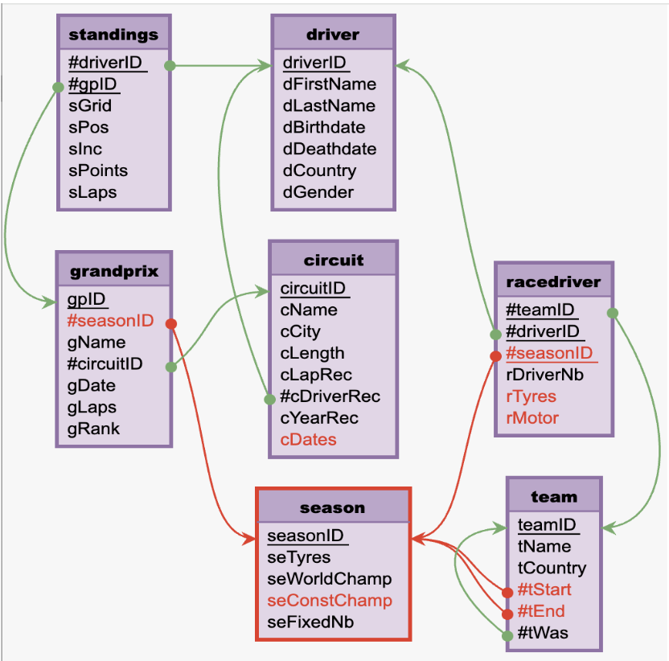

# TER_Web_Scraping
Ce projet de 12 semaines (L3 MIASHS) consiste à enrichir une base de données sur l'histoire de la F1 (1950-2025). L'objectif est de transformer des données web brutes en une structure relationnelle optimisée. Ce travail servira de support pédagogique pour les futurs cours de bases de données relationnelles du Master MAS.

# 🏎️ TER - Web Scraping : Enrichissement d'une base de données Formule 1

## 🎯 Contexte du projet
Ce projet a été réalisé dans le cadre de notre Travail Encadré de Recherche (TER) en Licence 3 MIASHS. L'objectif principal était d'enrichir une base de données relationnelle dédiée à la Formule 1, initialement prévue pour un cours de Master 1 MAS. 

Alors que la base de données initiale ne couvrait qu'une saison et demie (janvier 2013 à septembre 2014), notre mission a été d'utiliser des techniques d'extraction de données automatisées pour récupérer l'historique complet du championnat du monde, de 1950 à aujourd'hui.

## 🛠️ Technologies et Méthodes d'Extraction
Pour mener à bien cette collecte massive et pallier l'hétérogénéité des sites web, nous avons combiné plusieurs approches:
* **Requests & BeautifulSoup 4** : Utilisées pour l'extraction de données sur des pages web statiques (sans JavaScript), notamment pour parcourir les infoboxes de Wikipédia.
* **Selenium** : Déployé pour l'extraction de données générées dynamiquement (avec JavaScript), indispensable pour récupérer des historiques complexes sur des sites spécialisés comme StatsF1.
* **API Ergast** : Exploitée pour fiabiliser et accélérer la récupération des statistiques de courses et des classements au format JSON.

## 🗄️ Évolution de la Modélisation des Données
La base initiale comprenait 7 tables (Driver, Grandprix, Circuit, Team, Racedriver, Testdriver et Standings). Suite à notre analyse des données réellement disponibles et aux spécificités historiques de la F1, nous avons fait évoluer l'architecture:

* **Ajout de la table `Season`** : Création d'une table centrale pour gérer la temporalité, renseigner le champion de l'année, le manufacturier pneumatique, et lier plus logiquement les autres tables.
* **Restructuration temporelle** : Adaptation des tables `Team` et `Racedriver` pour gérer des situations historiques complexes (ex: numéros de voitures changeant à chaque course avant 1974) et ajout de dates de début/fin d'activité.

### Comparaison de l'architecture

**Base de données initiale :**

*(Remplacer le lien ci-dessus par le bon chemin vers ta capture de la Figure 2)*

**Base de données finale optimisée :**

*(Remplacer le lien ci-dessus par le bon chemin vers ta capture de la Figure 3)*

## 📂 Structure du Projet
* `Codes Python/` : Contient l'ensemble des scripts Python de scraping (BeautifulSoup, Selenium) et les requêtes API.
* `Fichiers finaux/` : Contient les fichiers CSV nettoyés et générés pour chaque table (près de 26 000 lignes pour la table Standings, plus de 700 pilotes recensés, etc.).
*  `Fichiers intermédiaires/` : Contient les fichiers CSV avec plus d'informations que nécéssaires et sans que les jointures n'ai été effectuées.
* `TER_Web_Scraping_Compte_Rendu_final.pdf` : est le compte-rendu final détaillant la méthodologie, les défis techniques rencontrés (nettoyage de données, limites des requêtes) et les dictionnaires de filiation.

## 👥 Équipe du Projet
Projet réalisé par Emmy BERNARD, Anaëlle EON, Youna-Marie BADOUARD et Juliette ORZAKIEWICZ , sous l'encadrement de Laurent Ughetto.
